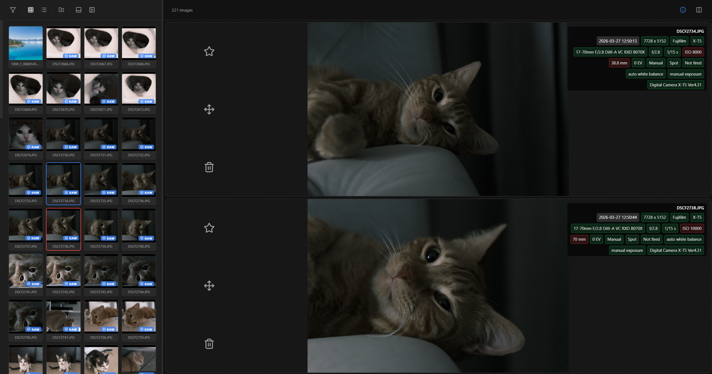

# Better Photo Chooser

A high-performance desktop application designed for photographers to efficiently cull, compare, and organize large collections of RAW and JPEG photos. Built with Tauri, Rust, and React.


## Features

*   **Dual Format Management:** Automatically detects and pairs `.jpg` and `.raf` (RAW) files. The grid view hides redundant RAW files while highlighting paired JPEGs with a "RAW" badge.
*   **Comparison View:** 
    *   **Synchronized Navigation:** Both panes stay in perfect sync for zoom and pan.
    *   **Double-Click Reset:** Instantly revert zoom to 100% with a double-click.
    *   **Layout Toggle:** Switch between Side-by-Side and Stacked modes depending on your screen.
*   **Detailed Metadata Explorer:** 
    *   Extracts comprehensive EXIF data (Aperture, ISO, Shutter Speed, Lens details, etc.).
    *   **Interactive Chips:** Metadata is displayed as chips with cross-pane hover synchronization.
*   **High-Performance Pipeline:**
    *   **Two-Stage Thumbnailing:** Instant EXIF thumbnail extraction with a SIMD-accelerated `fast_image_resize` fallback.
    *   **Concurrency Control:** A built-in limiter ensures the UI stays smooth even when loading folders with thousands of images.
    *   **Virtualization & Lazy Loading:** Uses Intersection Observer for efficient resource management.



## Technical Stack

*   **Backend (Rust):** 
    *   `fast_image_resize`: SIMD-accelerated image scaling.
    *   `exif`: High-speed metadata and thumbnail extraction.
    *   Tauri: Lightweight native bridge for file system operations.
*   **Frontend (React + TypeScript):**
    *   State-synchronized comparison engine.
    *   Responsive, resizable sidebar with grid/list view modes.
    *   Lucide-React for a premium icon set.
*   **Design:**
    *   Modern, dark-themed UI with glass touches.
    *   Interactive action zones for quick culling (Star, Move, Delete).

## Development

Ensure you have the system dependencies for Tauri and Rust installed.

Install node modules:
```bash
npm install
```

Run the application in development mode:
```bash
npm run tauri dev
```
